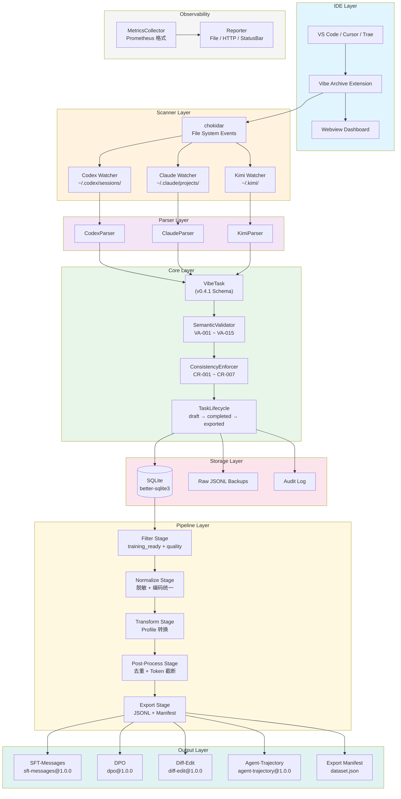
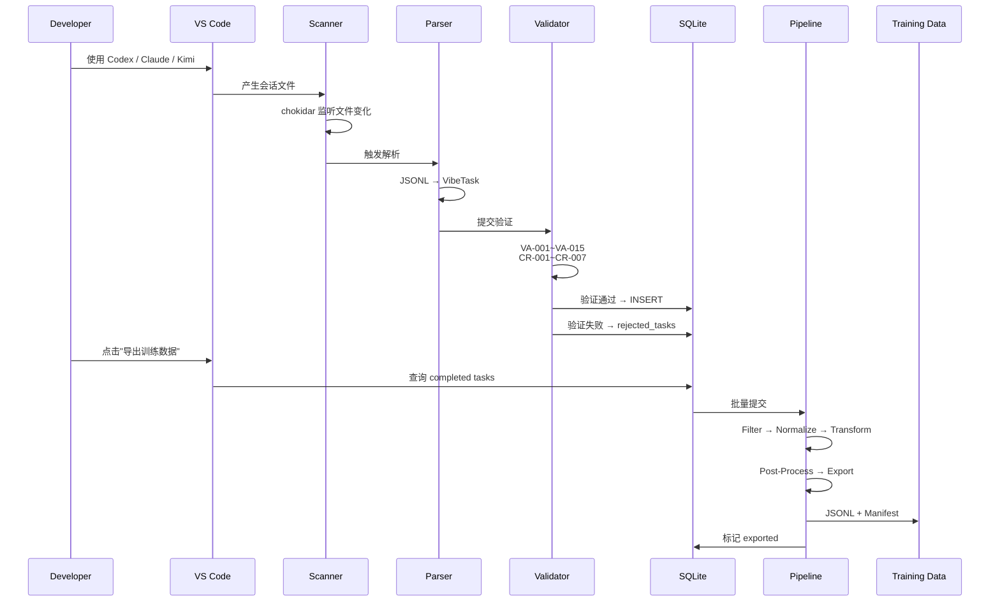
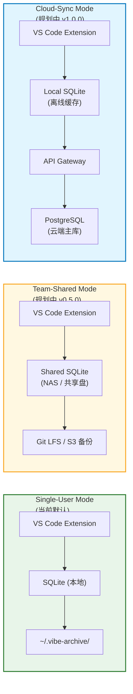
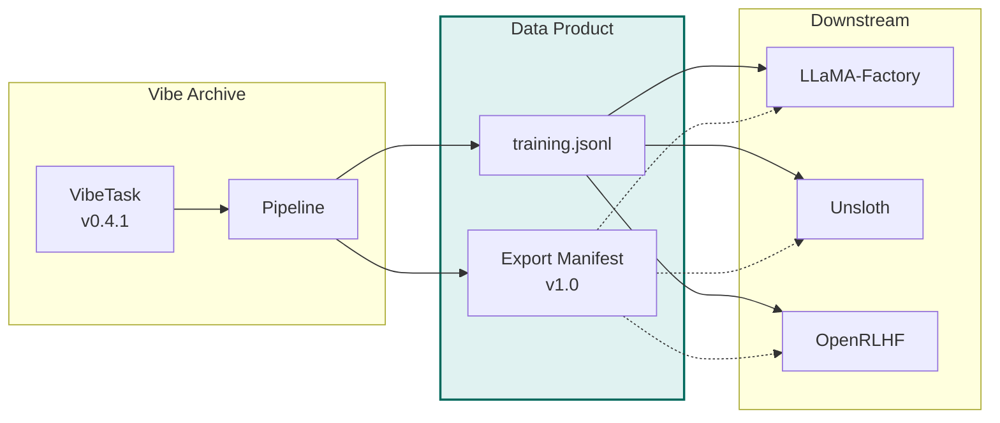

# Vibe Archive — 系统架构文档

> **版本**: arch-v1.0  
> **对应标准**: `vibe-archive.task.v0.4.1`  
> **对应 PRD**: `PRD-v2.1`

---

## 1. 总体架构



---

## 2. 数据流



---

## 3. 模块职责

| 层级 | 模块 | 职责 | 关键文件 |
|------|------|------|---------|
| **IDE** | Extension Host | 激活插件、注册命令、管理 Webview | `src/extension.ts` |
| **IDE** | Webview Dashboard | 会话浏览、搜索、筛选、导出 UI | `src/views/webview/` |
| **Scanner** | File Watcher | 监听 `~/.codex/`、`~/.claude/`、`~/.kimi/` | `src/scanner/watchers/` |
| **Scanner** | Session Scanner | 调度 Watcher、管理增量读取 offset | `src/scanner/SessionScanner.ts` |
| **Parser** | CodexParser | 解析 `rollout-*.jsonl` 为 VibeTask | `src/scanner/parsers/CodexParser.ts` |
| **Parser** | ClaudeParser | 解析 `~/.claude/projects/**/*.jsonl` | `src/scanner/parsers/ClaudeParser.ts` |
| **Parser** | KimiParser | 探测 `~/.kimi/` 结构并解析 | `src/scanner/parsers/KimiParser.ts` |
| **Core** | VibeTask Model | Pydantic/TS 类型，对齐 v0.4.1 | `src/types/` |
| **Core** | SemanticValidator | VA-001 ~ VA-015 语义规则 | `src/validator/SemanticValidator.ts` |
| **Core** | ConsistencyEnforcer | CR-001 ~ CR-007 一致性规则 | `src/consistency/ConsistencyEnforcer.ts` |
| **Core** | TaskLifecycle | 状态机管理：draft → completed → exported | `src/lifecycle/TaskLifecycle.ts` |
| **Storage** | DatabaseManager | SQLite 封装、事务、迁移 | `src/db/DatabaseManager.ts` |
| **Storage** | Raw Backup | 原始 JSONL 归档 | `~/.vibe-archive/backups/` |
| **Pipeline** | FilterStage | `training_ready` + `quality_score` + domain | `src/pipeline/stages/FilterStage.ts` |
| **Pipeline** | NormalizeStage | 脱敏、编码统一、敏感内容过滤 | `src/pipeline/stages/NormalizeStage.ts` |
| **Pipeline** | TransformStage | Profile 格式转换 | `src/pipeline/stages/TransformStage.ts` |
| **Pipeline** | PostProcessStage | 去重、Token 截断 | `src/pipeline/stages/PostProcessStage.ts` |
| **Pipeline** | ExportStage | JSONL + Manifest 输出 | `src/pipeline/stages/ExportStage.ts` |
| **Observability** | MetricsCollector | Counter / Gauge / Histogram | `packages/metrics/` |
| **Observability** | Reporter | File / HTTP / StatusBar 上报 | `packages/metrics/reporters/` |

---


---

## 4. 部署模式（Deployment Modes）

> **核心原则**：Vibe Archive 从 Day 1 就设计为可演进架构。Local-First 是默认，但不是唯一。



### 4.1 Single-User Mode（当前默认）

**架构特征**：
- **存储**: `~/.vibe-archive/` 本地 SQLite 单文件
- **隐私**: 数据不出本机，Local-First，零网络依赖
- **适用**: 个人开发者、隐私敏感场景、离线环境
- **限制**: 无法跨设备同步，无法团队协作

**配置**：
```bash
# 默认即此模式，无需配置
vibe-archive config get mode
# → single-user
```

**数据路径**：
```
~/.vibe-archive/
├── database/
│   └── vibe-archive.db          # SQLite 主库
├── backups/
│   ├── codex/YYYY/MM/DD/
│   ├── claude/{project-hash}/
│   └── kimi/
├── exports/
│   └── YYYY-MM-DD/
└── config.json
```

### 4.2 Team-Shared Mode（规划中 v0.5.0）

**架构特征**：
- **存储**: 共享 NAS / 网络盘 / 自托管 PostgreSQL
- **同步**: 基于文件锁或乐观锁的并发控制
- **权限**: 基于 `privacy.data_owner` + `governance.team_id` 的 RBAC
- **适用**: 小团队（< 20人），共享数据资产，统一质量标准
- **要求**: 团队内使用相同的数据标准版本和 Profile 版本

**配置**：
```bash
vibe-archive config set mode team
vibe-archive config set team.endpoint /mnt/shared/vibe-archive.db
vibe-archive config set team.sync_interval 300  # 5分钟同步
```

**并发策略**：
- 读取：无锁，本地缓存优先
- 写入：乐观锁（基于 `updated_at` 版本号），冲突时合并或提示
- 导出：由指定"数据管理员"角色执行，避免重复导出

### 4.3 Cloud-Sync Mode（规划中 v1.0.0）

**架构特征**：
- **架构**: 本地 SQLite 缓存 + 云端 PostgreSQL + API Gateway
- **同步**: 增量同步（基于 `updated_at` 时间戳 + 变更向量）
- **加密**: 端到端加密（`privacy.encryption_at_rest`），服务端不可见明文
- **合规**: `governance.audit_log` 全量上报云端，支持 SOC2 / ISO27001 审计
- **适用**: 企业级部署，跨地域团队，需要集中治理

**配置**：
```bash
vibe-archive config set mode cloud
vibe-archive config set cloud.endpoint https://api.vibe-archive.dev
vibe-archive config set cloud.api_key $VA_API_KEY
vibe-archive config set cloud.encryption true
```

**离线策略**：
- 本地缓存最近 30 天数据，支持完全离线工作
- 网络恢复后自动增量同步
- 冲突解决：LWW（Last Write Wins）+ 人工仲裁

### 4.4 模式对比表

| 维度 | Single-User | Team-Shared | Cloud-Sync |
|------|-------------|-------------|------------|
| 存储位置 | `~/.vibe-archive/` | NAS / 共享盘 | 本地缓存 + 云端 |
| 网络依赖 | 无 | 局域网 | 互联网（可离线） |
| 并发支持 | 单进程 | 多客户端 + 锁 | 多客户端 + 云端仲裁 |
| 数据主权 | 完全本地 | 团队共享 | 企业所有 |
| 加密 | 可选 | 可选 | 端到端加密 |
| 审计日志 | 本地文件 | 本地文件 | 云端集中 |
| 版本要求 | 无 | 全员一致 | 自动兼容 |
| 适用规模 | 1人 | 2-20人 | 20+人 |

### 4.5 模式切换迁移

```bash
# Single → Team: 导出并迁移
vibe-archive db export --db ~/.vibe-archive/ --output ./backup/
vibe-archive db import --db /mnt/shared/vibe-archive.db --input ./backup/
vibe-archive config set mode team

# Team → Cloud: 批量上传
vibe-archive cloud sync --db /mnt/shared/vibe-archive.db --endpoint https://api.vibe-archive.dev
vibe-archive config set mode cloud
```

---

## 5. Export Manifest（数据产品标准）

> **Export Manifest 是 Vibe Archive 的"数据产品说明书"，使训练数据集成为可追溯、可复现、可审计的标准化产品。**
>
> **独立规范文档**: [Vibe_Archive_Export_Manifest_v1.0.md](Vibe_Archive_Export_Manifest_v1.0.md)

### 5.1 为什么需要 Manifest

| 问题 | 没有 Manifest | 有 Manifest |
|------|-------------|-------------|
| 这份数据从哪来？ | 不知道 | `provenance.source_tasks_count` + `source_tools` |
| 质量怎么样？ | 要重新跑一遍 | `quality.avg_quality_score` + `test_pass_rate` |
| 能复现吗？ | 不能 | `pipeline.filter_config` + `post_process_config` |
| 合规吗？ | 不确定 | `license` + `data_classification` + `retention_policy` |
| 过期了吗？ | 不知道 | `source.generated_at` + `source.schema_version` |

### 5.2 Manifest 与生态的关系



### 5.3 Manifest 生成代码

```typescript
// src/pipeline/stages/ExportStage.ts
import * as crypto from 'crypto';

export class ExportStage {
  async process(batch: unknown[], config: ExportConfig): Promise<ExportResult> {
    const lines = batch.map(item => JSON.stringify(item)).join('
');
    const outputPath = path.join(config.outputDir, `${config.format}.jsonl`);

    await fs.promises.writeFile(outputPath, lines, 'utf-8');

    // 生成校验和
    const checksum = crypto.createHash('sha256').update(lines).digest('hex');

    // 生成 Manifest（严格遵循 v1.0 标准）
    const manifest = {
      manifest_version: 'vibe-archive.manifest.v1.0',
      dataset_id: `ds_${generateUlid()}`,
      dataset_name: config.datasetName || `${config.format}-${new Date().toISOString().split('T')[0]}`,
      source: {
        schema_version: 'vibe-archive.task.v0.4.1',
        profile: config.format,
        profile_version: config.profileVersion,
        generator: 'vibe-archive-cli@0.2.1',
        generated_at: new Date().toISOString(),
        repository: 'https://github.com/pzc163/vibe-archive.git'
      },
      content: {
        record_count: batch.length,
        file_path: `${config.format}.jsonl`,
        file_size_bytes: Buffer.byteLength(lines, 'utf-8'),
        format: 'jsonl',
        compression: 'none',
        checksum: {
          algorithm: 'sha256',
          value: checksum
        }
      },
      pipeline: {
        stages: ['filter', 'normalize', 'transform', 'post-process', 'export'],
        filter_config: config.filterConfig,
        post_process_config: config.postProcessConfig
      },
      quality: this.calculateQuality(batch),
      provenance: {
        source_tasks_count: config.sourceTaskCount,
        rejected_tasks_count: config.rejectedTaskCount,
        rejected_reasons: config.rejectedReasons,
        source_tools: config.sourceTools
      },
      license: config.license || 'CC-BY-SA-4.0',
      attribution: 'Generated by Vibe Archive CLI',
      retention_policy: config.retentionPolicy || 'keep_forever',
      data_classification: config.dataClassification || 'internal'
    };

    await fs.promises.writeFile(
      path.join(config.outputDir, `${config.format}.manifest.json`),
      JSON.stringify(manifest, null, 2)
    );

    return { outputPath, recordCount: batch.length, checksum, manifest };
  }

  private calculateQuality(batch: unknown[]): QualityMetrics {
    // 从 batch 中提取质量统计
    // ...
    return {
      avg_quality_score: 0.85,
      min_quality_score: 0.71,
      max_quality_score: 0.98,
      test_pass_rate: 0.94,
      has_user_modification_rate: 0.32
    };
  }
}
```

### 5.4 Manifest 验证

```bash
# 验证 Manifest 是否符合 v1.0 标准
vibe-archive manifest validate ./training/dpo.manifest.json

# 验证 Manifest 与数据文件是否匹配（checksum）
vibe-archive manifest verify ./training/dpo.manifest.json --data ./training/dpo.jsonl
```

---

## 6. 技术选型

| 组件 | 选型 | 理由 |
|------|------|------|
| 运行时 | Node.js 18+ | VS Code Extension Host 要求 |
| 语言 | TypeScript | 类型安全，对齐数据标准 |
| 构建 | esbuild | VS Code 官方推荐，极速构建 |
| 数据库 | better-sqlite3 | 同步 API，单线程友好 |
| 文件监听 | chokidar | 跨平台，稳定 |
| 测试 | Mocha + Chai | VS Code 扩展生态标准 |
| CLI | Commander.js | Node.js CLI 标准 |
| Metrics | 自研 Prometheus | 轻量，无外部依赖 |
| Webview | React 18 | 组件化，生态丰富 |

---

*本文档与 Vibe Archive Data Standard v0.4.1、Export Manifest v1.0、PRD-v2.1、DEVELOPMENT.md 保持同步。*
*仓库地址: https://github.com/pzc163/vibe-archive.git*
